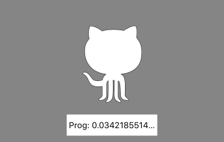
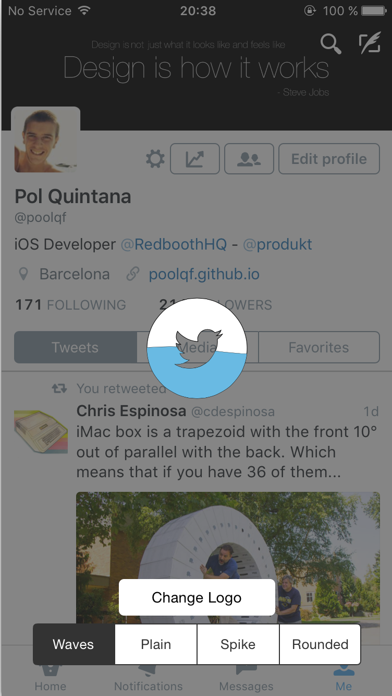

[](https://github.com/Carthage/Carthage)
# FillableLoaders

####Completely customizable progress based loaders drawn using custom `CGPath`s written in Swift

<p align="center">

</p>
<p align="center">
Waves
</p>

<p align="center">

</p>
<p align="center">
Plain
</p>

<p align="center">

</p>
<p align="center">
Spike
</p>

<p align="center">

</p>
<p align="center">
Rounded
</p>


###Demo:
<p align="center">

</p>

<p align="center">

</p>

###Changelog:
- __1.2.6__ (8 Apr 2016)
	- Fixing issue with width assert 
	- Adapted to Swift 2.2
- __1.2.5__ (11 Dec 2015)
	- Precompiled framework using Xcode 7.2
- __1.2.4__ (28 Oct 2015)
	- Fixing issue when showing loader after removing it
- __1.2.2__ (27 Oct 2015)
	- Precompiled framework using Xcode 7.1
- __1.2.1__ (25 Oct 2015)
	- Added the possibility to add a loader to a desired UIView
	- Updated to Swift 2.0 
- __1.1.1__ (2 Sep 2015)
	- Added Carthage Support
	- Added animation when hidding loader 
- __1.0.1__ (17 Aug 2015)
	- Removed unused code
- __1.0.0__ (7 Aug 2015)
	- Progress based loaders :tada:
	- Added documentation to all the public properties and functions
- __0.0.2 Initial Release__ (3 Aug 2015)


###Quick Start:
#### - Progress based behaviour
Therea are only 2 necessary things to make the progress based loader work:

- Create the loader using `showProgressBasedLoaderWithPath(path:)` or  `createProgressBasedLoaderWithPath(path:)`
- To update the fill progress, update the `progress` property of the loader, which goes from `0.0` to `1.0`

#### - Creation
There are four main methods to create the loaders:

`showProgressBasedLoaderWithPath(path:)`, `createProgressBasedLoaderWithPath(path:)`,`showLoaderWithPath(path:)` and `createLoaderWithPath(path:)`

`showLoaderWithPath(path:)` or `showProgressBasedLoaderWithPath(path:)` are going to call the create one, and after it, are going to call the `showLoader()` method.

So, it is just a helper method to do everything at once.

If you want to create the loader, and not show it at the same moment, you can use `createProgressBasedLoaderWithPath(path:)` or `createLoaderWithPath(path:)` to create it, and when you want to show it, just call `showLoader()`

Sample code:

``` swift
//PROGRESS BASED:
		
var loader = WavesLoader.createProgressBasedLoaderWithPath(path)
loader.loaderColor = UIColor.redColor()
        ...
//Do other stuff
        ...
loader.showLoader()
		
//BASIC

var loader = WavesLoader.createLoaderWithPath(path)
loader.loaderColor = UIColor.redColor()
        ...
//Do other stuff
        ...
loader.showLoader()
```

####- Showing loader in desired view:
All the methods wave the variant version where you can pass it the view in which you want to add the loader:

- `showProgressBasedLoaderWithPath(path:onView:)`
- `createProgressBasedLoaderWithPath(path:onView:)`
- `showLoaderWithPath(path:onView:)`
- `createLoaderWithPath(path:onView:)`


#### - Deletion:
Just call the method `removeLoader()` and the loader will disappear and will also be removed from its superview.

Sample code:

``` swift
loader.removeLoader()
```

### Customization:

Apart from being able to customize the loader shape, you can also customize other properties of the loader. Take a look at the list:

- __progressBased__: Bool	
Indicates if the loader movement is progress based or not (Default: false)
- __progress__: CGFloat		
Loader fill progress from 0.0 to 1.0 . It will automatically fire an animation to update the loader fill progress
- __backgroundColor__: UIColor?         
Background of the loader view (transparent by default)
- __loaderColor__: UIColor?             
Color of the filled loader
- __loaderBackgroundColor__: UIColor?   
Color of the unfilled loader
- __loaderStrokeColor__: UIColor?       
Color of the path stroke
- __loaderStrokeWidth__: CGFloat        
Width of the path stroke
- __loaderAlpha__: CGFloat              
Alpha of the loader view (1.0 by default)
- __cornerRadius__: CGFloat             
Corner radius of the loader view (0.0 by default)
- __duration__: NSTimeInterval          
Duration of the animations (10.0 by default)
- __rectSize__: CGFloat                 
Height of the loader view
- __swing__: Bool                       
Bool to indicate if the loader has to swing when going up (small rotation, not available for the Plain loader)


#####Extra property for `Spikes` and `Rounded` loaders:

- __-spikeHeight__: CGFloat		
Height of the spike


###Installation:
####• CocoaPods

```
use_frameworks!

pod 'FillableLoaders', '~>1.2.6'
```
####• Carthage

```
github "poolqf/FillableLoaders" ~> "1.2.6"
```

###How to create my own CGPath?

###### :warning: The CGPath bounds cannot exceed the bounds of the loaderView:
- Width: Screen width
- Height: rectSize property

####• Manually

``` swift
let path = CGPathCreateMutable()
CGPathMoveToPoint(path, nil, 0, height/2)
CGPathAddLineToPoint(path, nil, width + 100, height/2)
CGPathAddLineToPoint(path, nil, width + 100, height*2)
CGPathAddLineToPoint(path, nil, 0, height*2)
CGPathCloseSubpath(path)
return path
```

####• PaintCode

__[PaintCode](http://www.paintcodeapp.com)__ is a realy powerful Mac app that can do a lot of things. 
You can just draw things, and it will __automagically__ create the code for you

In this case we can use it to create BezierPaths, and extract from there the CGPath.

In the case of drawing a star, it is going to give us this code:

``` swift
//// Star Drawing
var starPath = UIBezierPath()
starPath.moveToPoint(CGPointMake(180, 25))
starPath.addLineToPoint(CGPointMake(195.16, 43.53))
starPath.addLineToPoint(CGPointMake(220.9, 49.88))
starPath.addLineToPoint(CGPointMake(204.54, 67.67))
starPath.addLineToPoint(CGPointMake(205.27, 90.12))
starPath.addLineToPoint(CGPointMake(180, 82.6))
starPath.addLineToPoint(CGPointMake(154.73, 90.12))
starPath.addLineToPoint(CGPointMake(155.46, 67.67))
starPath.addLineToPoint(CGPointMake(139.1, 49.88))
starPath.addLineToPoint(CGPointMake(164.84, 43.53))
starPath.closePath()
UIColor.grayColor().setFill()
starPath.fill()

```

The only thing we have to do here is extract the CGPath from the UIBezierPath like so:

``` swift
let myPath = starPath.CGPath
var myLoader = WavesLoader.showProgressBasedLoaderWithPath(myPath)
```

####• SVG + PaintCode

A feature that I `LOVE` from PaintCode is that you can import an .svg file, and it is going to create the code to create its BezierPath. Completely awesome.

That's how I did the Github and Twitter logos, for example.

### Technical details:
- Swift 2.1
- Animations using CAKeyFrameAnimation

###Licenses
All source code is licensed under the MIT License.

If you use it, i'll be happy to know about it.

### Pol Quintana - [@poolqf](https://twitter.com/poolqf)
